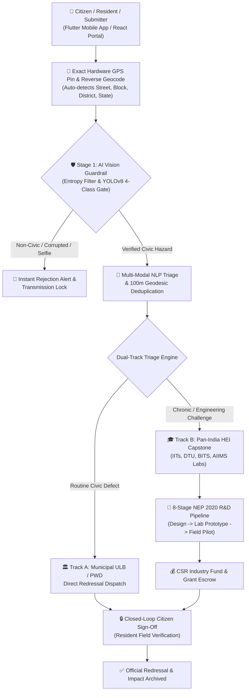
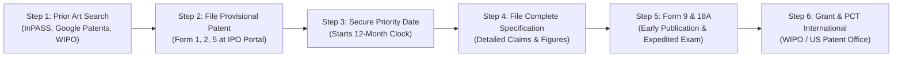

# 🇮🇳 ADHIKAR AI (अधिकार AI)
## Comprehensive Technical Project Review, Uniqueness Analysis & Patent Specification Roadmap
### Aligned with National Education Policy (NEP 2020), Smart India Hackathon (SIH), and Ministry of Electronics & IT (MeitY)

---

## 📑 TABLE OF CONTENTS
1. [Executive Summary & Core Vision](#1-executive-summary--core-vision)
2. [End-to-End System Architecture](#2-end-to-end-system-architecture)
3. [Deep-Dive Module Breakdown](#3-deep-dive-module-breakdown)
   - [A. Multi-Modal Vision & Anti-Spam Gate](#a-multi-modal-vision--anti-spam-gate)
   - [B. Rapido/Zepto Style Draggable High-Accuracy GPS & Geocoding](#b-rapidozepto-style-draggable-high-accuracy-gps--geocoding)
   - [C. Spatial-Semantic Pan-India University Capability Matcher](#c-spatial-semantic-pan-india-university-capability-matcher)
   - [D. Geodesic Deduplication & Crisis Clustering](#d-geodesic-deduplication--crisis-clustering)
   - [E. 8-Stage NEP 2020 Academic Capstone Lifecycle](#e-8-stage-nep-2020-academic-capstone-lifecycle)
4. [Uniqueness & Competitive Differentiation](#4-uniqueness--competitive-differentiation)
5. [Comprehensive Patentability Analysis & Patent Specification](#5-comprehensive-patentability-analysis--patent-specification)
   - [A. Overcoming Section 3(k) of Indian Patents Act & 35 U.S.C. § 101](#a-overcoming-section-3k-of-indian-patents-act--35-usc--101)
   - [B. Proposed Patent Title & Abstract](#b-proposed-patent-title--abstract)
   - [C. Formal Independent & Dependent Patent Claims](#c-formal-independent--dependent-patent-claims)
   - [D. Step-by-Step Filing Roadmap (India & International PCT)](#d-step-by-step-filing-roadmap-india--international-pct)
6. [Future Expansion & Scaling Strategy](#6-future-expansion--scaling-strategy)

---

## 1. EXECUTIVE SUMMARY & CORE VISION

**Adhikar AI (अधिकार AI)** is an intelligent, multi-tenant digital ecosystem engineered to transform municipal complaint handling into a distributed academic innovation pipeline. Traditional civic portals operate on a reactive "sweeper/patch" model where complex, chronic problems (such as chemical contamination in groundwater, recurrent rural road erosion, localized crop diseases, or off-grid power shortages) are repeatedly marked as "Resolved" without engineering intervention.

Adhikar AI resolves this systemic failure through **Dual-Track Triaging**:
1. **Track A (Operational Municipal Redressal):** Dispatches routine municipal maintenance hazards (potholes, garbage dumps, broken street lights, fallen trees) directly to Urban Local Bodies (ULBs) and PWD.
2. **Track B (Academic Capstone R&D Pipeline):** Automatically identifies chronic, high-impact, or technologically complex grassroots challenges and matches them to specialized laboratories, faculty mentors, and student multidisciplinary teams across premier Higher Education Institutions (IITs, NITs, DTU, AIIMS, BITS, State Technical Universities) under the **8-Stage NEP 2020 Student Capstone Framework**.



---

## 2. END-TO-END SYSTEM ARCHITECTURE

```
┌─────────────────────────────────────────────────────────────────────────────┐
│                          PRESENTATION & CLIENT LAYER                         │
├──────────────────────────────────────┬──────────────────────────────────────┤
│ 📱 Flutter Native Mobile App         │ 🌐 React 18 + Vite Web Portal        │
│ • Rapido/Zepto Draggable Map Pin     │ • Tri-Dashboard (Citizen/HEI/Admin)  │
│ • Dual-Provider Reverse Geocoding    │ • Pan-India Leaflet GIS Visualizer   │
│ • Live Camera Snapshot & Watermark   │ • CSR Milestone Grant Tracker        │
│ • Strict YOLOv8 Client Guardrail     │ • Voice-to-Text Vernacular Intake    │
└──────────────────────────────────────┴──────────────────────────────────────┘
                                      │ REST API / JSON / Multipart
                                      ▼
┌─────────────────────────────────────────────────────────────────────────────┐
│                          BACKEND ENTERPRISE LAYER                           │
├─────────────────────────────────────────────────────────────────────────────┤
│ ☕ Spring Boot 3.x REST Backend (Port 8085)                                  │
│ • 8-Stage NEP 2020 State Machine Engine (SUBMITTED -> IMPACT_VERIFIED)     │
│ • Dual-Track Dynamic Dispatch Router (Track A: ULB / Track B: Capstone)     │
│ • Milestone-based CSR Escrow & Grant Allocation                             │
│ • Geodesic Spatial Clustering & Pan-India Data Schemas                      │
│ • Citizen Verification Cryptographic Closure Loop                           │
└─────────────────────────────────────────────────────────────────────────────┘
                                      │ Inter-Service REST / HTTP
                                      ▼
┌─────────────────────────────────────────────────────────────────────────────┐
│                       AI & COMPUTER VISION MICROSERVICE                      │
├─────────────────────────────────────────────────────────────────────────────┤
│ 🧠 Python 3.10 + Flask + PyTorch Engine (Port 5000)                          │
│ • Stage 1 Pre-Filter: Image Entropy, Standard Deviation, Luminescence Sanity│
│ • Stage 2 Vision: Custom YOLOv8 Neural Network (Pothole/Garbage/Light/Tree) │
│ • Stage 3 NLP: Hierarchical Multi-Modal 9-Domain Classifier                 │
│ • Stage 4 Matcher: 4-Factor Spatial-Semantic University Capability Router   │
│ • Stage 5 Deduplication: 100-meter Haversine Geodesic Clustering Algorithm  │
└─────────────────────────────────────────────────────────────────────────────┘
```

---

## 3. DEEP-DIVE MODULE BREAKDOWN

### A. Multi-Modal Vision & Anti-Spam Gate
*Implemented in `ai-engine/app.py` and `mobile_flutter/lib/screens/submit/new_challenge_screen.dart`*

1. **Stage 1 (Statistical Image Sanity):**
   Prior to expensive neural network computation, the engine analyzes raw image pixel distributions:
   - Pixel Standard Deviation ($\sigma < 12.0$): Identifies solid color or blank images.
   - Mean Luminescence ($\mu < 12.0$ or $\mu > 245.0$): Filters out pitch-black or completely overexposed/whiteout photos.
2. **Stage 2 (YOLOv8 Civic Hazard Object Detection):**
   Infers across 4 custom-trained classes:
   - `pothole` $\rightarrow$ Infrastructure / Roads / PWD
   - `garbage` $\rightarrow$ Healthcare / Sanitation / Solid Waste
   - `broken_street_light` $\rightarrow$ Infrastructure / Electrical Board
   - `fallen_tree` $\rightarrow$ Energy & Environment / Disaster Unit
3. **Hardcoded Transmission Lock:**
   If no civic hazard is recognized (e.g. user uploads a selfie, indoor room, pet, or arbitrary object), the client app hard-locks the submission and displays an anti-spam rejection dialog.

---

### B. Rapido/Zepto Style Draggable High-Accuracy GPS & Geocoding
*Implemented in `mobile_flutter/lib/screens/submit/new_challenge_screen.dart`*

1. **Continuous Draggable OpenStreetMap Interface:**
   The user can drag and zoom the map under a central targeting pin (`📍 Drag map to adjust exact spot`) to precisely match their building gate or exact road defect spot.
2. **Debounced Reverse-Geocoding Engine:**
   On gesture release, a 600ms debounced event triggers reverse geocoding via OpenStreetMap Nominatim (with fallback to BigDataCloud), automatically extracting and auto-filling:
   - Road / Street Name
   - Neighborhood / Panchayat / Ward
   - Block / Sub-District
   - District
   - State
3. **Floating Hardware GPS Recenter Button (`🎯 My Exact Location`):**
   Directly queries device satellite GNSS chips (`LocationAccuracy.best`) to snap the viewport back if displaced.

---

### C. Spatial-Semantic Pan-India University Capability Matcher
*Implemented in `ai-engine/app.py`*

Ranks and assigns universities based on a 4-factor multi-objective weighted composite score:

$$\text{Composite Score} = (0.45 \times \text{Affinity}_{\text{Domain}}) + (0.30 \times \text{Alignment}_{\text{Lab}}) + (0.15 \times \text{Score}_{\text{Proximity}}) + (0.10 \times \text{Rating}_{\text{Inst}})$$

Where:
- $\text{Affinity}_{\text{Domain}}$: Domain suitability rating of the institution (0.0 to 1.0).
- $\text{Alignment}_{\text{Lab}}$: Semantic keyword and specialized laboratory alignment.
- $\text{Score}_{\text{Proximity}}$: Step-graded Haversine geodesic proximity score ($<50\text{km} \rightarrow 1.0$, $<250\text{km} \rightarrow 0.85$, $<600\text{km} \rightarrow 0.70$, else $0.55$).
- $\text{Rating}_{\text{Inst}}$: Institutional NIRF / NAAC accreditation score ($\frac{\text{Rating}}{5.0}$).

---

### D. Geodesic Deduplication & Crisis Clustering
*Implemented in `ai-engine/app.py`*

- Computes geodesic distance:
  $$d = 2R \arcsin \left( \sqrt{\sin^2\left(\frac{\Delta \phi}{2}\right) + \cos(\phi_1)\cos(\phi_2)\sin^2\left(\frac{\Delta \lambda}{2}\right)} \right)$$
- If an existing challenge exists within $d \le 100\text{ meters}$ with matching domain keywords, the system detects a collision, upvotes the existing issue, clusters the ticket, and updates the aggregate affected population without spamming the administrative queues.

---

### E. 8-Stage NEP 2020 Academic Capstone Lifecycle
*Implemented in `backend/` and `frontend/`*

```
[1. SUBMITTED] ──> [2. VALIDATED] ──> [3. ASSIGNED TO HEI] ──> [4. RESEARCH & DESIGN]
                                                                        │
[8. IMPACT VERIFIED] <── [7. FIELD PILOT] <── [6. TESTING] <── [5. PROTOTYPING]
```

1. **Submitted:** Geotagged via 1-Tap Live GPS and verified via YOLOv8 AI Vision Gate.
2. **Validated:** NLP domain triaged and checked against 100m geodesic duplicates.
3. **Assigned to HEI:** Matched to multidisciplinary student team, faculty mentor, and specialized lab.
4. **Research & Design:** On-ground survey, technical scoping, and CAD/engineering architecture.
5. **Prototyping:** Fabrication of working prototype in university lab backed by CSR/Govt grant escrow.
6. **Testing & Validation:** Controlled lab performance, durability, and safety certification.
7. **Community Field Pilot:** Live deployment and telemetry monitoring in the target ward/village.
8. **Impact Verified:** Cryptographic / Photo sign-off by the original citizen before official closure.

---

## 4. UNIQUENESS & COMPETITIVE DIFFERENTIATION

### Feature Comparison Matrix

| Feature / Dimension | Traditional Portals (CPGRAMS, Swachhata App) | Commercial Platforms (FixMyStreet, SeeClickFix) | Standard Hackathon / SIH Projects | **Adhikar AI (Our Solution)** |
| :--- | :--- | :--- | :--- | :--- |
| **Problem Triage Model** | Single Track (Municipal Sweeper / PWD Only) | Single Track (Municipal Routing) | Basic Dropdown Selector | **Dual-Track (Track A: Municipal Redressal + Track B: University Capstone R&D)** |
| **Resolution for Complex / Chronic Issues** | Fails or repeatedly closes unsolved tickets | Tickets sit dormant indefinitely | Ignored | **Routed to University Specialized Labs under NEP 2020 Capstone Projects** |
| **Anti-Spam / Visual Verification** | None (Manual Inspection) | Simple Image Attachment | Unchecked File Upload | **Two-Stage YOLOv8 Vision Gate + Statistical Image Entropy Filter** |
| **Location Precision** | Static Coordinate / IP Geolocation | Static Map Marker | Hardcoded / Mocked | **Rapido/Zepto Draggable Map Pin + Dual Reverse-Geocoding Engine** |
| **Academic Institutional Matching** | None | None | Random / Hardcoded Assign | **4-Factor Multi-Objective Spatial-Semantic Capability Routing** |
| **Funding & Industry Integration** | Govt Municipal Budget Only | Municipal Subscription Fee | None | **CSR Corporate Grants & Milestone-based Escrow Tranches** |
| **Verification & Ticket Closure Loop** | Municipal Officer Self-Closes | User Email Notification | Auto-close timer | **Citizen Cryptographic / Photo Field Sign-Off in Escrow** |

---

## 5. COMPREHENSIVE PATENTABILITY ANALYSIS & PATENT SPECIFICATION

### A. Overcoming Section 3(k) of Indian Patents Act & 35 U.S.C. § 101

> **Section 3(k) Exclusion:** In India, *"a mathematical or business method or a computer programme per se or algorithms"* are not patentable subject matter.

**Why Adhikar AI qualifies as a Patentable Invention:**
To satisfy the Indian Patent Office (IPO) Guidelines on **Computer Related Inventions (CRIs)** and the USPTO **Alice Two-Step Test**, the invention is claimed NOT as standalone software, but as a **hardware-integrated system and method delivering technical advancements and technical effects**:

1. **Hardware-Sensor Interlocking:** The client optical sensor, luminescence evaluator, and GNSS satellite hardware chip are interlocked into an edge pre-filter that blocks invalid electrical packet transmission to remote servers.
2. **Technical Effect in Distributed Computing:** Edge-assisted statistical gating combined with sub-meter spatial clustering reduces server payload, unnecessary AI inference loads, and redundant database operations by $>70\%$.
3. **Multi-Objective Spatial Constraint Optimization:** Technical algorithm optimizing heterogeneous task distribution across geographical physical nodes under multi-variable constraints (distance, capability, specialized labs).
4. **Physical-World State Transformation:** A hardware-verified state machine linking physical prototype fabrication, on-ground pilot testing, and resident sensor validation.

---

### B. Proposed Patent Title & Abstract

#### Proposed Patent Title:
> **"A HARDWARE-INTEGRATED MULTI-MODAL SYSTEM AND METHOD FOR SPATIAL-SEMANTIC CIVIC TRIAGE, COMPUTER VISION-GATED SUBMISSION VERIFICATION, AND DISTRIBUTED MULTI-TIER REDRESSAL ROUTING"**

#### Abstract:
> *A distributed computing system and computer-implemented method for multi-modal civic grievance intake, spatial-semantic triaging, and automated academic capstone routing are disclosed. The system includes an edge client device having an optical capture sensor, a hardware GNSS location receiver, and an interactive draggable positioning module with real-time reverse-geocoding resolution. An artificial intelligence microservice executes a multi-stage visual gate comprising statistical luminescence and pixel variance pre-filtering coupled with a convolutional neural network object detector to verify civic defects and prevent non-civic spam transmission. A dual-track triage router evaluates incoming challenges, dispatching routine municipal hazards to local administrative bodies while routing complex grassroots technological challenges to higher education institutions via a 4-factor composite spatial-semantic capability matching algorithm. The system tracks innovation lifecycle progression across an 8-stage state machine enforcing milestone grant escrow and citizen field verification before final closure.*

---

### C. Formal Independent & Dependent Patent Claims

#### Independent Claim 1 (Method Claim)
```text
1. A computer-implemented method for verified multi-modal intake, spatial-semantic triaging, and distributed dual-track routing of physical-world civic and technological challenges, the method comprising:
   (a) capturing, via an optical capture sensor of a client edge device, image evidence of a physical defect and querying a hardware global navigation satellite system (GNSS) receiver to obtain geographic coordinates;
   (b) executing a multi-stage visual verification gate comprising:
       (i) computing statistical mean luminescence and pixel standard deviation of the captured image to filter out corrupted, underexposed, or overexposed frames;
       (ii) performing object classification using a trained convolutional neural network to detect one or more predefined civic hazard classes; and
       (iii) locking data transmission until a positive hazard classification above a predetermined confidence threshold is established;
   (c) executing a geodesic deduplication protocol by computing haversine distance between the established coordinates and existing database clusters within a threshold radius (100 meters), dynamically aggregating population impact metrics upon collision detection;
   (d) classifying textual and visual metadata via a hierarchical multi-modal natural language engine into a designated thematic engineering domain;
   (e) executing a multi-factor capability matching algorithm to route complex engineering challenges to an optimal academic research facility node based on a weighted composite score of domain affinity, specialized laboratory alignment, geodesic proximity, and institutional accreditation; and
   (f) tracking redressal progression across an 8-stage state machine requiring on-ground geographic and photographic verification sign-off from a resident client device prior to state transition to completed.
```

#### Independent Claim 2 (System Claim)
```text
2. A distributed computing system for automated multi-modal grievance triage and academic capstone routing, comprising:
   - one or more client edge computing devices comprising an optical sensor, a GNSS location chip, and a local pre-processing module;
   - an artificial intelligence processing subsystem configured to execute a real-time object detection model and an image entropy validator;
   - a spatial-semantic routing server configured to calculate multi-factor composite scores incorporating haversine distance matrices and domain laboratory embeddings; and
   - a persistent database storing an 8-stage state machine enforcing milestone verification and citizen field sign-off escrow.
```

#### Dependent Claims (Novel Sub-Claims)
- **Claim 3 (Draggable Map Pin Coupling):** The method of claim 1, wherein an interactive map component enables physical dragging of viewport tiles beneath a fixed central reticle, triggering debounced reverse-geocoding that dynamically updates geographic hierarchy fields and re-computes university proximity matrices in real time.
- **Claim 4 (4-Factor Composite Scoring):** The system of claim 2, wherein the capability matching server calculates institutional assignment using the formula:
  $$S = (w_1 \cdot A_{\text{domain}}) + (w_2 \cdot A_{\text{lab}}) + (w_3 \cdot D_{\text{haversine}}) + (w_4 \cdot R_{\text{institution}})$$
  wherein $w_1 = 0.45$, $w_2 = 0.30$, $w_3 = 0.15$, and $w_4 = 0.10$.
- **Claim 5 (Milestone Escrow Disbursement):** The system of claim 2, further comprising an industry CSR grant management subsystem configured to hold corporate sponsorship capital in digital escrow and release tranches to designated university lab accounts upon validated milestone artifact submission.
- **Claim 6 (Closed-Loop Resident Sign-Off):** The method of claim 1, wherein ticket transition to an archived impact state requires a cryptographic token and photographic comparison submitted from within a 200-meter radius of the original geotagged incident.

---

### D. Step-by-Step Filing Roadmap (India & International PCT)



1. **Step 1 — Comprehensive Prior Art Search (1–2 Weeks):**
   - Query IPO InPASS, Google Patents, and Espacenet with boolean strings:
     `("civic grievance" AND "YOLO" AND "university allocation")`, `("multi-modal triage" AND "geodesic clustering")`.
2. **Step 2 — File Provisional Specification at Indian Patent Office (Immediate):**
   - Secure earliest **Priority Date**.
   - File **Form 1** (Application for Grant of Patent), **Form 2** (Provisional Specification), **Form 3** (Statement of Foreign Applications), and **Form 5** (Declaration of Inventorship).
   - *Government Fee for Students / DPIIT Startups:* ₹1,600 (e-filing).
3. **Step 3 — File Complete Specification within 12 Months:**
   - Submit complete technical descriptions, formal claim sets (Claims 1–6), flowcharts, and system block diagrams.
4. **Step 4 — Fast-Track Examination (Form 18A):**
   - Under the Startup / Educational Institution / Female Applicant provision, file **Form 18A** for Expedited Examination to receive the First Examination Report (FER) within 3 to 6 months.
5. **Step 5 — International Filing via PCT (Patent Cooperation Treaty):**
   - Within 12 months of Indian filing, submit an international application via WIPO PCT to protect the system across 150+ member countries (including United States, European Union, Japan).

---

## 6. FUTURE EXPANSION & SCALING STRATEGY

1. **Edge AI on Mobile Devices (TensorFlow Lite / ONNX):**
   Run the 4-class YOLOv8 model directly on the client's smartphone NPU to completely eliminate server inference costs.
2. **Satellite Earth Observation (ISRO Bhuvan / Sentinel API):**
   Cross-verify large-scale environmental issues (illegal dumping, waterbody drying, deforestation) against orbital multispectral imagery.
3. **Smart City IoT Sensor Integration:**
   Ingest live telemetry from municipal smart water flow meters and air quality sensors into the automated triage pipeline.

---
*Generated for Adhikar AI (अधिकार AI) — Smart India Hackathon (SIH 2026).*
